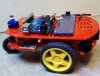

<h3> &nbsp;&nbsp;&nbsp; 'CARkar22' autonomous robot   highlights </h3>

differential wheeldrive 
Arduino Uno processorboard -ATMEGA328 uproc 
sharp GP2Y0A60SZLF ranging sensors (3) 
TSSP77038 front wide angle proximity sensors (2)  
RC5 remote control   
4 quadrant encoders !! 
2S Lipo battery 1000 mAh 
8.3V switched mode wheelDriveSupply regulator 
Batwat Lipo supervisor refer: "https://home.hccnet.nl/coen.roos"

